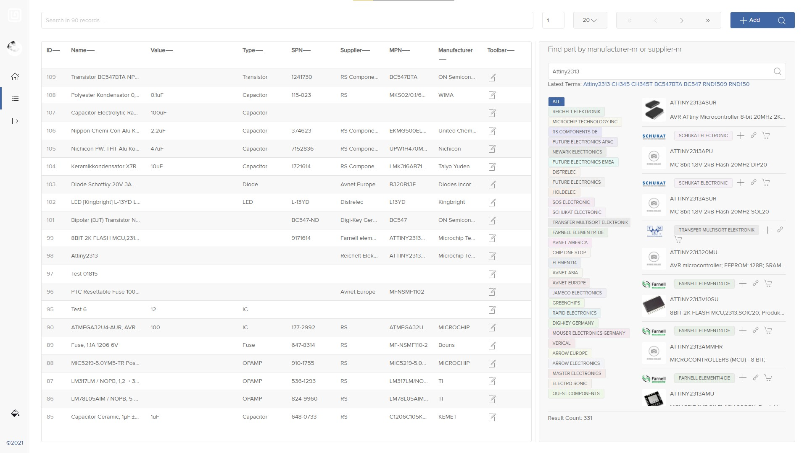

# **PIA**  ( **P**arts **I**nventory **A**ssistant ) ( evolved )

This is a &#x26A0; __working in progress__ &#x26A0; Electronics Parts/component Inventory Application called PIA using ExpressJS and ReactJS but ___without___ [CRA](https://github.com/facebook/create-react-app).

There a many ready to use Inventory-Systems or -Applications written in PHP or other languages
with a huge overkill about functions or server configurations.
What I need is a lightweight system running local or everywhere with a fast lightning search and easy to extend.


__Please note:__  __WIP__ means, proof of concept and not finishid yet !

---

## Screenshots

| Light | Dark |
|--|--|
|  |  |
|  |  |
|  | 
|  | 
|  | 
---

  - [Introduction](#introduction)
    - [Alternatives](#alternatives)
    - [Development mode](#development-mode)
    - [Production mode](#production-mode)
  - [Quick Start](#quick-start)
  - [Documentation](#documentation)
    - [Folder Structure](#folder-structure)
    - [ESLint](#eslint)
    - [Nodemon](#nodemon)
    - [Express](#express)
    - [Concurrently](#concurrently)
    - [VSCode + ESLint + Prettier](#vscode--eslint--prettier)


---

## Introduction

Why without [Create React App](https://github.com/facebook/create-react-app) ?
CRA is a quick way to get started with React development and it requires no build configuration.
But it completely hides the build config which makes it difficult to extend. In short it is a Black Box!
Another point is, we don't need all with CRA shipped packages.


### PIAs Future Tasks
- DOT.ENV Support &#x2714;
- ~~Initial setup process~~
- Build Process &#x2714;
- Vercel App Integration &#x2714;
- Electron Wrapper ( ? )
- ~~Octopart API Integration ( ? )~~
- OEMSecret API Integration &#x2714;
- BOM Imports
- Projects BOMs
- Dark Mode according OS Settings &#x2714;
- Github Login &#x2714;
- ~~Github Gists as DB~~
- Repository as Storage using [GitRows](https://github.com/gitrows/gitrows)


### Alternatives

- [Part-DB](https://github.com/Part-DB/Part-DB)
- [Partsbox](https://partsbox.com/)
- [Partkeepr](https://partkeepr.org/)
- [Bomist](https://bomist.com/)
- [Binner](https://github.com/replaysMike/Binner)
- [Applications using Octopart](https://octopart.com/api/app-gallery)


### Development mode

In the development mode, we will have 2 servers running. The front end code will be served by the [webpack dev server](https://webpack.js.org/configuration/dev-server/) which helps with hot and live reloading. The server side Express code will be served by a node server using [nodemon](https://nodemon.io/) which helps in automatically restarting the server whenever server side code changes.

## Quick Start

```bash
# Clone the repository
$ git clone https://github.com/vlrmprjct/pia

# Go inside the directory
$ cd pia

# Install dependencies
$ yarn

# Start development server
$ yarn start

# Build for production
$ yarn build

```

## Documentation

### Authorization

The authorisation is quite simple by using Github as Authorisation provider. So no username and passwort is needed for using PIA.
Just a Github-Account is needed.

### Folder Structure

All the source code will be inside `./src` directory. Inside src, there is client and server directory. All the frontend code (react, css, js and any other assets) will be in client directory. Backend Node.js/Express code will be in the server directory.

### Storage

We use [GitRows](https://github.com/gitrows/gitrows) as Data-Storage Provider.
Gitrows fetches data from a repository, whether is it `public` or `private`.

In our case, it is a **private repository**, so no one has access!

Test it: [PIA-Datebase](https://github.com/vlrmprjct/pia-database). You should get a `404` response.!

### ESLint

[We using Airbnb's Javascript Style Guide](https://github.com/airbnb/javascript) which is used by many JavaScript developers worldwide. Since we are going to write both client (browser) and server side (Node.js) code, Optionally, we can override the Airbnb's configurations to suit our needs. I have turned off [**no-console**](https://eslint.org/docs/rules/no-console), [**comma-dangle**](https://eslint.org/docs/rules/comma-dangle) and [**react/jsx-filename-extension**](https://github.com/yannickcr/eslint-plugin-react/blob/master/docs/rules/jsx-filename-extension.md) rules.

### Nodemon

Nodemon is a utility that will monitor for any changes in the server source code and it automatically restart the server. This is used in development only.

Below is the `nodemon.json` file which we using.

```javascript
{
  "watch": ["src/server/"],
  "delay": 500
}
```

Here, we tell nodemon to watch the files in the directory src/server where out server side code resides. Nodemon will restart the node server whenever a file under src/server directory is modified after a short delay.

### Express

Express is a web application framework for Node.js. It is used to build our backend API's.

`src/server/index.js` is the entry point to the server application. Below is the src/server/index.js file

### Concurrently

[Concurrently](https://github.com/kimmobrunfeldt/concurrently) is used to run multiple commands concurrently. We using it to run the webpack dev server and the backend node server concurrently in the development environment. Below are the npm/yarn script commands used.

```javascript
        "start": "concurrently 'npm run start:client' 'npm run start:server' 'nodemon dist/server.js'",
        "start:client": "webpack-dev-server --config config/webpack.config.js --config-name client --env.development --hot",
        "start:server": "webpack --config config/webpack.config.js --config-name server --env.development --profile --watch"
```
